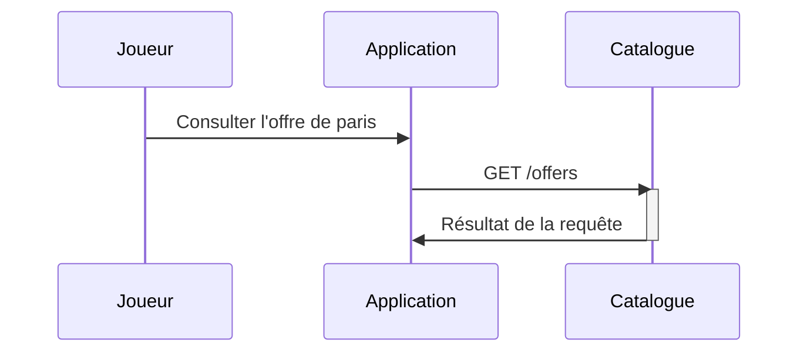
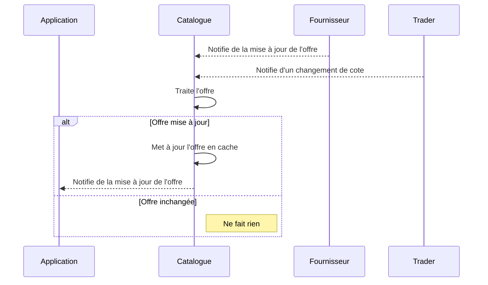
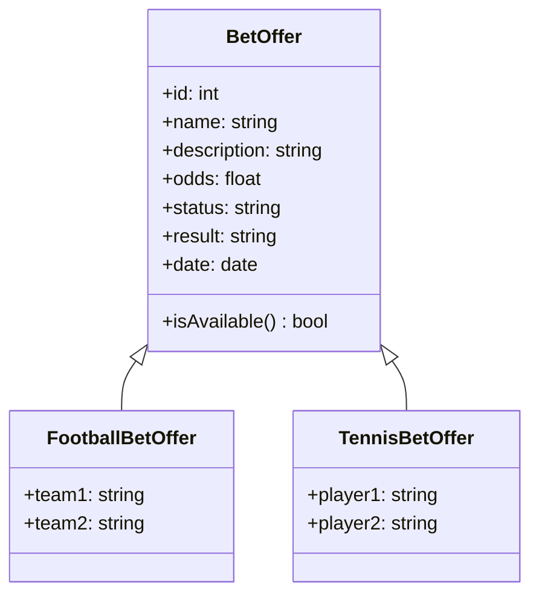
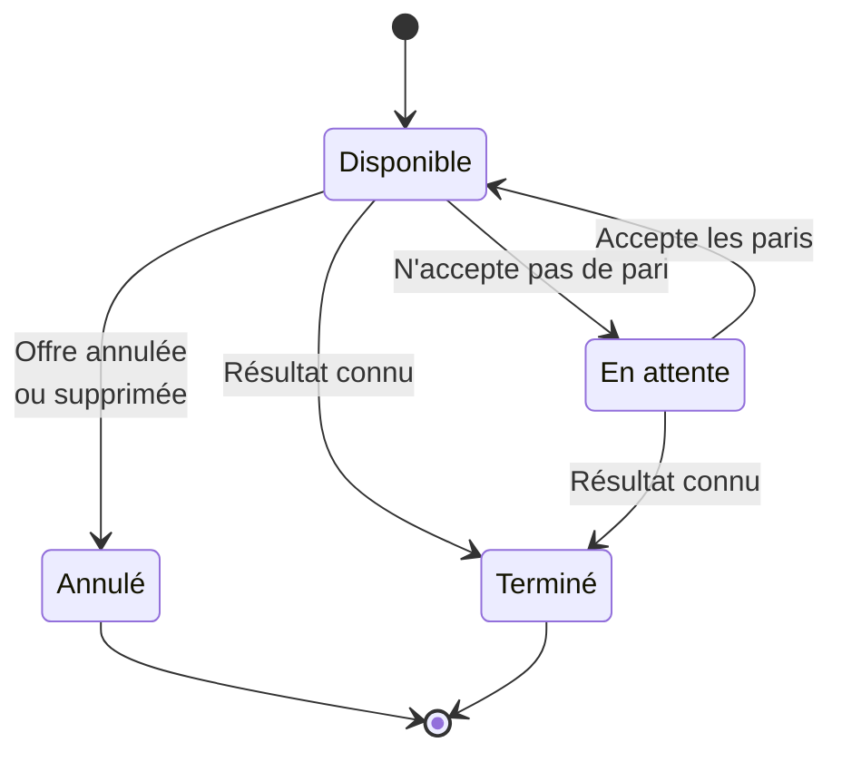

# StuDay: Créer des diagrammes via code

## Sujet

Paris sportifs:

* Consulter l'offre de paris

## Diagramme de cas d'utilisation

En tant que joueur, je peux consulter l'offre de paris pour pouvoir poser un pari.

En tant que Catalogue, je peux répondre à une requête de consultation de l'offre de paris.

## Représentation des données

## Répresentation de l'état de l'offre

## Ouvrir une PR sur GitHub 

GitHub est capable d'afficher les diagrammes Mermaid

## Importer le diagramme sur Draw.io

Draw.io est capable d'importer (mais pas d'exporter) les diagrammes Mermaid

## (Re)parler de l'avantage de Mermaid avec GitHub Copilot

Assistance à la création des diagrammes (syntaxe Mermaid) et fonctionnel 

## Conclusion

* Prise en main rapide
  * Intégré à l'IDE
  * Assistance GitHub Copilot
* Multiples types de diagrammes
  * Séquence
  * Classe
  * État
  * Flow
* Import Draw.io
* Visualisation GitHub

## Évoquer les limitations

* Design basique
* Pas d'image
* Pas de bibliothèque d'icônes pour les diagrammes d'architecture (AWS, Azure, etc.)

## Évoquer les alternatives

Diagram propose une alternative pour créer ses diagrammes d'architecture
* [Diagrams](https://diagrams.mingrammer.com/docs/getting-started/examples) en Python (ou en Go)

